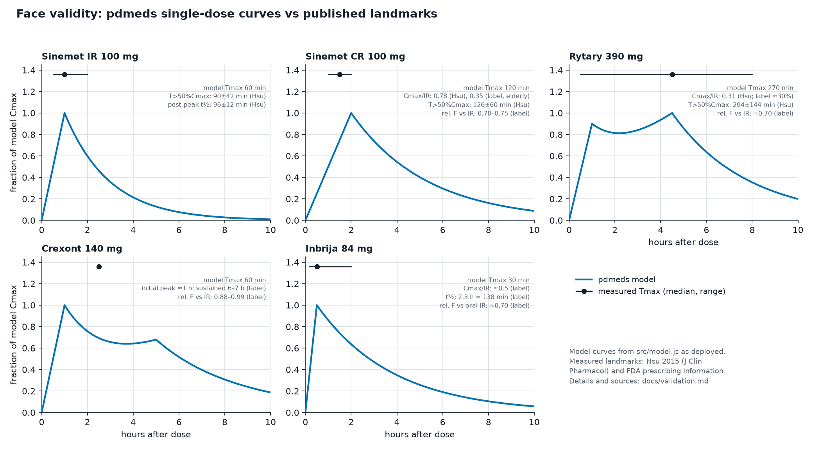
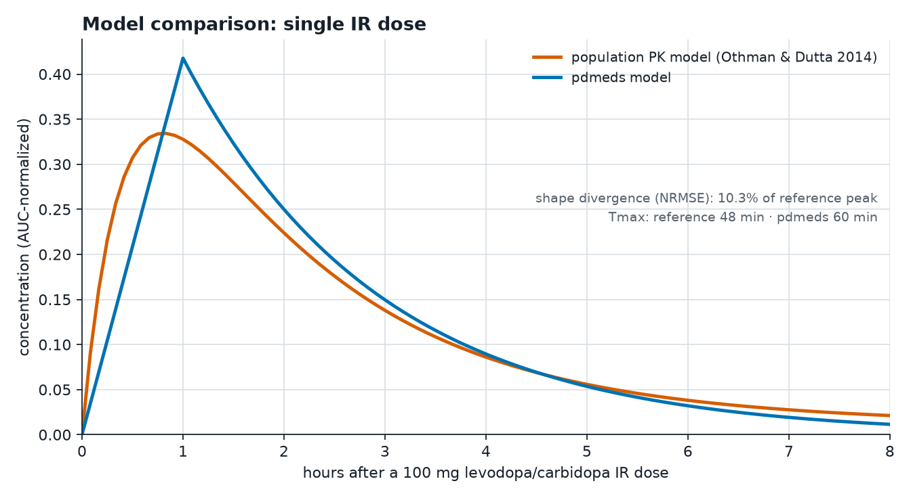
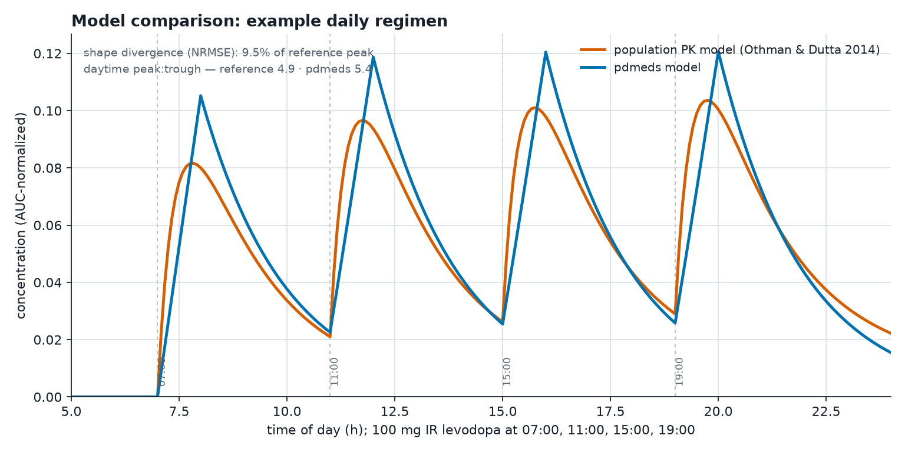

# Validation of the pdmeds exposure model

**Scope.** This document records two checks of the exposure model shipped in
`src/model.js` / `src/drugs.js`: a **face-validity** comparison of each
formulation's single-dose curve against published pharmacokinetic landmarks,
and a **model comparison** against a published population-pharmacokinetic
(popPK) model of oral levodopa/carbidopa. Both are reproducible:

```sh
node scripts/validation.mjs          # computes curves, landmarks, and metrics
python3 scripts/validation_plots.py  # renders the figures (matplotlib)
```

**What this does and does not establish.** These checks show the model's
curve *shapes* are consistent with published population **means** and with an
externally evaluated popPK model. They do **not** show the model predicts any
individual patient: real levodopa kinetics vary widely with gastric emptying
(often delayed in Parkinson disease), dietary protein, time of day, and
between and within patients (coefficients of variation of 30–50% are typical
— see the SD ranges below), and plasma concentration is not clinical effect.
The tool remains a population-level visualization, not a prediction.

---

## Part 1 — Face validity against published landmarks

Model curves were generated with the deployed code (single dose at t=0) and
landmark statistics extracted numerically. Reference values come from a
head-to-head PK study of the oral formulations in the same subjects
([Hsu 2015, J Clin Pharmacol](https://doi.org/10.1002/jcph.514)) and FDA
prescribing information.



| Formulation | Landmark | Model | Measured (source) | Verdict |
|---|---|---|---|---|
| Sinemet IR 100 mg | Tmax | 60 min | 60 min, range 30–120 (Hsu) | match |
| | post-peak t½ | 81 min | 96 ± 12 min (Hsu) | ~16% fast |
| | time above 50% Cmax | 111 min | 90 ± 42 min (Hsu) | within SD |
| Sinemet CR 100 mg | Tmax | 120 min | 90 min (60–120) (Hsu); ≈120 min (label, elderly) | match |
| | Cmax vs IR (dose-norm.) | 0.43 | 0.78 (Hsu, young); 0.35 (label, elderly single dose) | between conflicting sources |
| | AUC vs IR | 0.75 | 0.70–0.75 (label) | match |
| Rytary 390 mg | Tmax | 270 min | 270 min, range 30–480 (Hsu) | match |
| | Cmax vs IR (dose-norm.) | 0.18 | 0.31 (Hsu); ≈0.30 (label) | **underestimates peak ≈40%** |
| | time above 50% Cmax | 376 min | 294 ± 144 min (Hsu) | within SD, high |
| | AUC vs IR | 0.50 | ≈0.70 (label rel. bioavailability) | **deliberate divergence — see below** |
| Crexont 140 mg | initial peak | 60 min | ≈1 h (label) | match |
| | overall Tmax | 60 min (IR component highest) | ≈2.5 h (label; ER phase highest) | **shape differs: model's IR peak dominates** |
| | sustained window | ≈5.6 h above 50% | "maintained 6–7 h" (label) | close |
| | AUC vs IR | 0.50 | 0.88–0.99 (label rel. bioavailability) | **deliberate divergence — see below** |
| Inbrija 84 mg | Tmax | 30 min | 30 min, range 10–120 (label) | match |
| | Cmax vs IR (dose-norm.) | 0.47 | ≈0.5 (label) | match |
| | post-peak t½ | 138 min | 2.3 h = 138 min (label) | match |
| | AUC vs oral IR | 0.69 | ≈0.70 (label) | match |

**The LED-vs-bioavailability divergence.** The model scales each curve's
area by the drug's levodopa-equivalent dose factor (Jost 2023). For Rytary
(LED ×0.5 vs measured relative bioavailability ≈0.70) and especially Crexont
(LED ×0.5 assumed vs measured ≈0.9), LED equivalence is *lower* than
pharmacokinetic bioavailability — the consensus holds that a milligram of ER
levodopa buys less clinical effect than its plasma exposure alone suggests.
The tool therefore under-draws the plasma exposure of the ER capsules
relative to physiology, by design, in exchange for making curve areas
comparable in clinical-equivalence terms. Readers comparing formulations
should know the curves encode **LED-weighted exposure**, not raw
concentration. The Crexont peak ordering (the model's 1-hour IR peak is its
global maximum; the label reports the ER phase carrying the true Cmax at
≈2.5 h) is a genuine shape limitation of the current two-component fit.

## Part 2 — Comparison with a published population PK model

Reference: the two-compartment popPK model of oral levodopa/carbidopa in
advanced Parkinson disease from
[Othman & Dutta 2014, Br J Clin Pharmacol 78:94–105](https://doi.org/10.1111/bcp.12324)
(absorption rate 2.4 h⁻¹ ≈ 25-min mean absorption time; CL/F 24.8 L/h;
Vc/F 58.5 L; Q/F 6.8 L/h; Vp/F 72.9 L; externally evaluated against 311
additional subjects). Simulated here by 1-minute RK4 integration
(`scripts/validation.mjs`).

**Anchor check.** For a single 100 mg dose the reference model predicts
Cmax ≈ 1110 ng/mL, Tmax 48 min, post-peak t½ ≈ 87 min — against measured
values of 1094 ± 401 ng/mL, 60 min, and 96 ± 12 min
([Hsu 2015](https://doi.org/10.1002/jcph.514)). The reference is therefore a
faithful stand-in for measured data.





With both curves normalized to equal area:

| Metric | Single 100 mg dose | 4 × 100 mg day (07/11/15/19) |
|---|---|---|
| Shape divergence (NRMSE, % of reference peak) | 10.3% | 9.5% |
| Tmax (reference vs pdmeds) | 48 vs 60 min | each peak ≈ 45–60 min later in pdmeds |
| Daytime peak:trough ratio | — | 4.9 vs 5.4 |

**Where the models agree:** overall daily architecture — the number, order
and approximate depth of troughs, the rise toward each dose's peak, the
inter-dose decay, and the peak-to-trough swing (within ≈10%).

**Where they diverge, and why:**

- **Absorption phase.** The popPK model rises smoothly (first-order
  absorption); pdmeds rises linearly and peaks ≈12 min later and ≈20% higher
  (once AUC-matched). Real absorption is more variable than either.
- **Tail.** The popPK model is biphasic (distribution + elimination) with a
  shallower late tail; pdmeds decays mono-exponentially at 81 min and
  under-draws concentrations beyond ≈5 h post-dose.
- **No lag, no variability.** Neither divergence above includes the real
  phenomena both models omit at the individual level: absorption lag,
  double peaks from erratic gastric emptying (documented in
  [Senek 2018](https://doi.org/10.1007/s00228-018-2497-2), which needed two
  parallel absorption pathways to fit observed double-peak profiles), meals,
  and 30–50% inter-individual variability.

## Sources

- Hsu A, et al. Comparison of the pharmacokinetics of an oral
  extended-release capsule formulation of carbidopa-levodopa (IPX066) with
  immediate-release carbidopa-levodopa, sustained-release carbidopa-levodopa,
  and carbidopa-levodopa-entacapone. *J Clin Pharmacol* 2015;55:995–1003.
  [doi:10.1002/jcph.514](https://doi.org/10.1002/jcph.514)
- Othman AA, Dutta S. Population pharmacokinetics of levodopa in subjects
  with advanced Parkinson's disease: levodopa-carbidopa intestinal gel
  infusion vs. oral tablets. *Br J Clin Pharmacol* 2014;78:94–105.
  [doi:10.1111/bcp.12324](https://doi.org/10.1111/bcp.12324)
- Senek M, Nyholm D, Nielsen EI. Population pharmacokinetics of
  levodopa/carbidopa microtablets. *Eur J Clin Pharmacol* 2018;74:1299–1307.
  [doi:10.1007/s00228-018-2497-2](https://doi.org/10.1007/s00228-018-2497-2)
- Kuoppamäki M, et al. Comparison of pharmacokinetic profile of levodopa
  throughout the day between levodopa/carbidopa/entacapone and
  levodopa/carbidopa. *Eur J Clin Pharmacol* 2009;65:443–455.
  [doi:10.1007/s00228-009-0622-y](https://doi.org/10.1007/s00228-009-0622-y)
- FDA prescribing information: Rytary (carbidopa/levodopa ER capsules),
  Crexont (carbidopa/levodopa ER capsules), Inbrija (levodopa inhalation
  powder), Sinemet CR (carbidopa/levodopa sustained-release).
- Jost ST, et al. Levodopa dose equivalency in Parkinson's disease: updated
  systematic review and proposals. *Mov Disord* 2023;38:1236–1252.
  [doi:10.1002/mds.29410](https://doi.org/10.1002/mds.29410)
